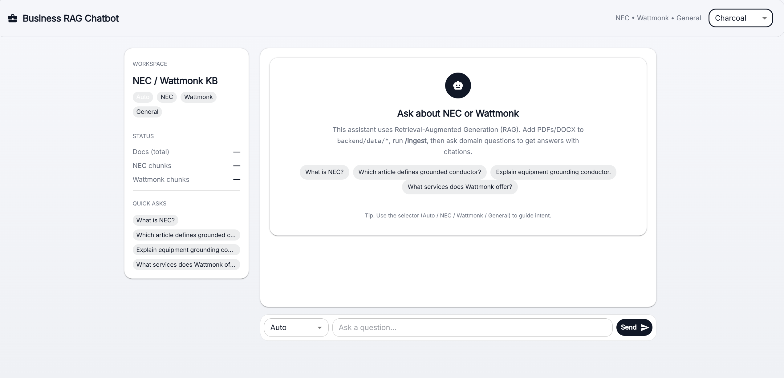
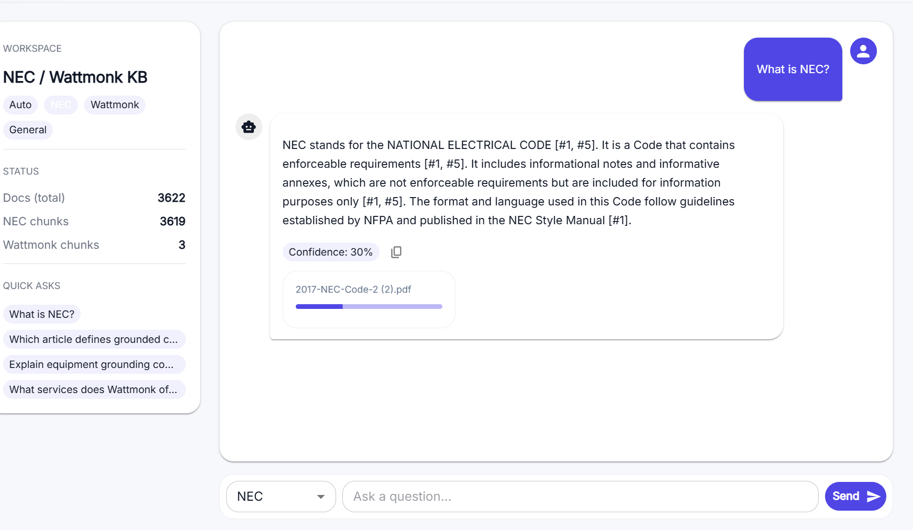
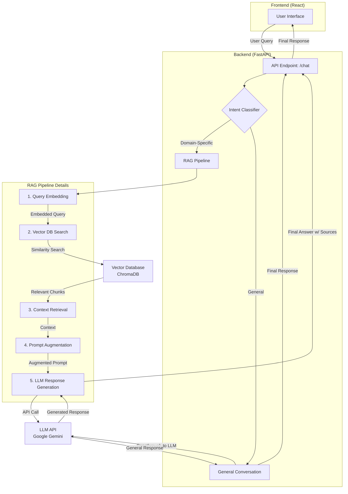

# RAG-Based Chatbot

This project focusing on the development of a **Retrieval-Augmented Generation (RAG)** based chatbot. The chatbot is designed to handle queries across multiple knowledge domains—**NEC Code Guidelines** and **Wattmonk Company Information**—while also managing general conversational questions.

> ## 🚀 **Live Demo**
>
> * **Frontend Application:** `https://rag-bot-five.vercel.app/`
> * **Backend API:** `https://rag-bot-0qow.onrender.com`

## 📸 Screenshots

Here's a look at our application in action!







## 📋 Project Overview

The primary objective is to build a context-aware chatbot that can seamlessly switch between its base knowledge for general conversation and two specific knowledge bases for technical and company-related questions. The RAG pipeline enables the model to retrieve relevant information from a vector database and use it to generate accurate, source-backed answers.

The two specialized knowledge domains are:
* **NEC Code Guidelines**: Technical standards and regulations for electrical wiring and equipment.
* **Wattmonk Company Information**: Internal documentation regarding company policies, services, and procedures.

## ✅ Features Checklist

This section maps the implemented features directly to the functional requirements outlined in the assignment document.

### Core Features

* `[x]` **Multi-Context Handling**: The chatbot successfully distinguishes between NEC, Wattmonk, and general queries.
* `[x]` **Source Attribution**: Responses generated from knowledge bases clearly indicate the source documents.
* `[x]` **Conversation Memory**: The system maintains conversational context across multiple user exchanges.
* `[x]` **Fallback Responses**: Gracefully handles queries that are outside the scope of its knowledge bases.

### Advanced Features (Bonus)

* `[x]` **Document Citations**: Links responses to specific chunks/sections of the source documents.
* `[x]` **Confidence Scoring**: Displays a confidence level for generated responses to indicate reliability.

## 🛠️ Architecture & Tech Stack

The application is built with a decoupled frontend and backend architecture to ensure scalability and maintainability.

* **Frontend**: A responsive user interface built with **React.js (Vite)** and **Material-UI**.
* **Backend**: A robust API server developed with **FastAPI**.
* **AI/ML Models**: The RAG pipeline uses API-based models from **Google (Gemini)** for generating embeddings and synthesizing responses.
* **Vector Database**: **ChromaDB** is used as the vector store for local development and deployment.
* **Deployment**: The frontend is hosted on **Vercel**, and the backend is deployed on **Render**.

## 🏗️ System Design Diagram

This diagram illustrates the flow of information from the user query to the final response, detailing the components of the RAG pipeline.


## ⚙️ Local Setup & Installation

Follow these steps to run the project on your local machine.

### Prerequisites

* Node.js (v18 or higher)
* Python 3.10 or higher
* `pip` and `venv`

### 1. Backend Setup

```bash
# Navigate to the backend directory
cd backend

# Create and activate a virtual environment
python -m venv venv
# On Windows: venv\Scripts\activate
# On macOS/Linux: source venv/bin/activate

# Install the required Python packages
pip install -r requirements.txt

# Set up environment variables
# This file will contain your API KEY
cp .env.example .env
# Now, open .env and add your API key.

# Start the FastAPI server
uvicorn main:app --reload --port 8000
```
### 2. Frontend Setup
```bash
# Open a new terminal and navigate to the frontend directory
cd frontend

# Install the required npm packages
npm install

# Set up environment variables
# This file points to your backend API URL
cp .env.example .env
# VITE_API_BASE_URL should be http://localhost:8000 for local development.

# Start the React development server
npm run dev
```
### 3. Data Ingestion

To populate the vector database, place your PDF, DOCX, or TXT files into the `backend/data/nec/` and `backend/data/wattmonk/` directories. Then, run the ingestion endpoint:

```bash
# Use curl or any API client to send a POST request
curl -X POST http://localhost:8000/ingest
```


## 📁 Project Structure
```
RAG-Based-Chatbot/
├── backend/
│   ├── data/
│   │   ├── nec/         # Drop NEC files here
│   │   └── wattmonk/    # Drop Wattmonk files here
│   ├── vectorstore/     # ChromaDB local storage
│   ├── .env             # Environment variables
│   ├── ingest.py        # Data loading and processing script
│   ├── main.py          # FastAPI application entrypoint
│   └── requirements.txt # Python dependencies
│
└── frontend/
├── src/
│   ├── App.jsx      # Main React component
│   └── main.jsx     # Application entrypoint
├── .env             # Environment variables
├── package.json     # Node.js dependencies
└── vite.config.js   # Vite configuration
```
## 📖 Usage Guide

* **Sending a Query**: Type your question in the input box and press Enter.
* **Context Selection**: The chatbot automatically classifies the intent. You can also manually select a context (NEC, Wattmonk, or General) from the UI.
* **Source Citations**: When an answer is generated from a document, bracketed numbers like `[1]` will appear. Clicking these reveals the specific text chunk from the source document used to generate the answer.

## 🚀 Deployment

The application has been successfully deployed and is publicly accessible.

* **Frontend (Vercel)**: The React application is deployed on Vercel, which provides CI/CD directly from the GitHub repository's `frontend` directory.
* **Backend (Render)**: The FastAPI application is deployed on Render. API keys and other secrets are securely configured as environment variables in the Render dashboard to prevent exposure.


